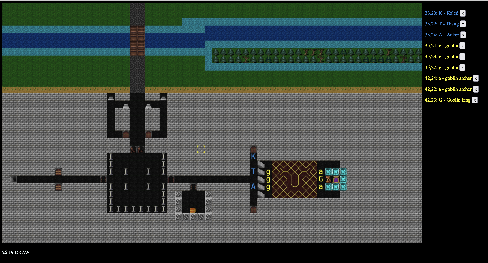

# rogue-vtt

A multi-user dungeon mapping system for OSR games in the style of nethack/dcss

Goals: a shared battlemap for live dungeon mapping during online play.

- no character sheets / no logic
- just shared mapping to get a sense of the space
- not meant for pre-made maps 

Client: Typescript/svelte + websockets
Server: Rust 

Extremely, extremely alpha: 

- barebones client is in 
  - just enough UI to generate the events to send/recieve to the server for most functionality 
  - you start in view mode (v).  Clicking moves the camera.  Arrow keys moves the camera 
  - press (d) to move into draw mode: 
    - press (1) to bring up the dungeon floor/wall picker 
    - click on tiles to draw them
    - you can click+drag to draw a larger area 
    - press (2) to bring up the dungeon feature picker 
    - dungeon features are a layer ontop of the dungeon floor/wall layer 
    - press shift-d while clicking (or click dragging) to remove tiles 
    - arrow keys still move around the camera
  - press (p) to go into place mode: 
    - click will open up a console that lets you put in players/npcs 
  - to delete a token: click on the `x` in the sidebar
  - to move a token, click on the token in the sidebar, this will enter move mode 
    - clicking again will place the tile on the map 

Plan: 

- go start the backend for saving state, room management, people joining the same "game", websocket comms, syncing state 
- come back and make the UI not janky 

## Getting started

This isn't ready for prod yet, still heavy in local development. 

We fire up svelte/vite so we get good svelte error messages.  But this means our JS is being served by one webserver while the rust app also serves some routes, which is not how it will be in prod. 

Regardless: 

- Clone this repo 
- go to `/client` and run `npm install` followed by `npm run dev` to fire up the vite server to serve the JS 
- install rust 
- cargo run in the main repo to build + compile the server 

The two things will chat to each other. 

<<todo>> eventually replace this with better instructions 

